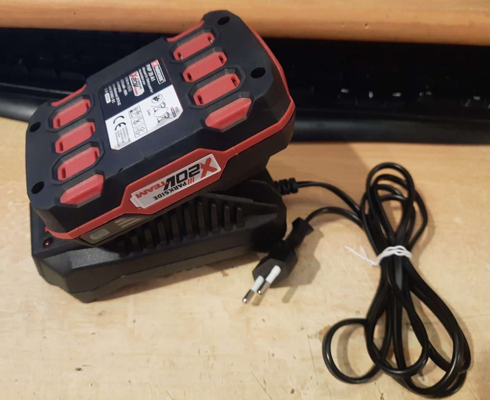
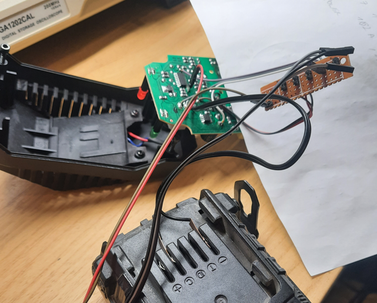
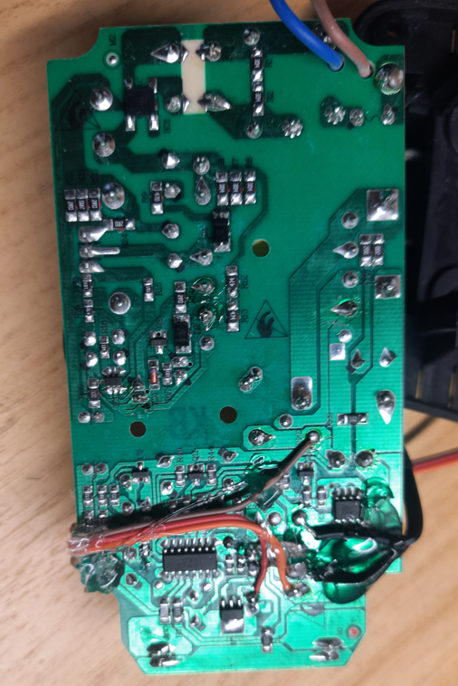
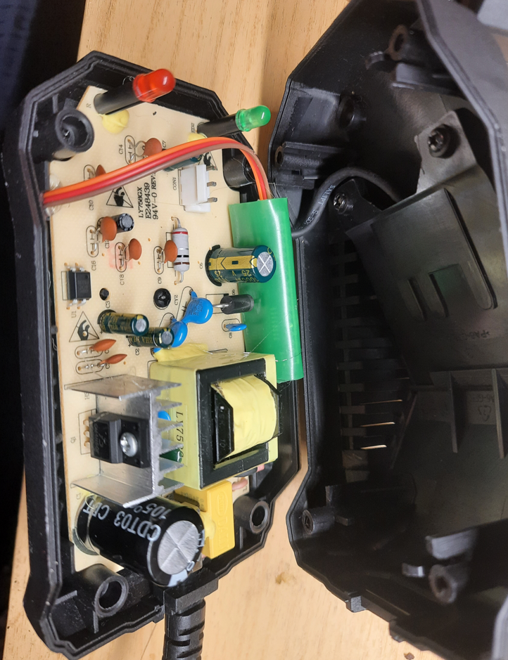

# parkside-battery-hack
Hack which allow for the PLG 20 A1 charger to charge old style parkside 21V batteries (and possibly others)
### Status update: Battery died roughly 4 months after this change

## TLDR: Use Arduino Nano to fake the impulses sent by battery to enable the charger to work. See code for more info.
# The story
Some time ago a friend asked me if I could fix his parkside drill charger. Obviously I couldn't refuse, I love fixing stuff even when it makes little economic sense.

After taking a quick peek at the internals, it was obvious that it wouldn't be an easy job.
What I assumed were current sense/limiting resistors were completely vaporized. Main switching transistor was shorted, and I had little trust in the primary side switching ic. especially when I had no part number nor datasheet for it.
Replacement chargers were not available since it's an old design, but more modern chargers were available cheaply. We thought that maybe we could just simply replace the internals?

It doesn't look half bad, it seems like the battery is just being connected through MOSFET switch. The third pin marked as "ID" is probably used to check if the battery is inserted.
Maybe it would work if I connected the battery directly?

It didn't work. This charger have some self diagnostics which sense that the output is shorted/overloaded and disconnects the battery terminals from voltage output. In this case it was completely disabling the primary side switching IC, since the output voltage kept falling to approx 2V.

But how? Obviously we have an optocoupler. Normally this optocoupler would work with TL431 reg to regulate output voltage, but circuit in this charger was more complicated.

Obviously, I did not have a schematic available, so some reverse engineering was needed.
First thing I like to do when REing a board is to find details about the largets IC. In this case it was a LGT8P22A.
But the research resulted in only finding someone who had the same problem as I did.
Even the search on Baidu which sometimes help when researching obscure chineese ICs resulted in me finding someone who tried to find more data about this part.

# Reverse engineering
This board is a very simple single sided board, so reverse enginnering it was relatively pleasant experience.
After maybe 2 hours to mark the connections and another 2 hours to redraw the schematics I had something I could work with.

Resistors and capacitors are easy, since values are already written on them.
With some other components, i could immediately decode what they were using standard smd code books.
Others were more tricky, such as the what I guess is the main switching IC, and some SOT23 parts.
Thanks to the schematics above I assumed that the SOT23 part had to be a TL431 clone. The only way to find out if it was was to measure voltage at X terminal.
Beautiful 2.5V confirmed my suspicions. This charger is alsmost identical to standard issue TL431 powered isolated SMPS.
The only interesting thing was this weird combination of 2 resistors and  1 capacitor connected between TL431  and LGT8P22A.
It had to be an output from LGT8P22A since if we assume that the path is high impedance we can see that we cannot get the nominal 21V at the output needed to charge the battery packs.

The only way that we could get 21v at battery terminals is when this branch would be tied to GND.
So this pin has to be some kind of output. Rather large R and C looks a lot like a low pass filter. Maybe it's simple PWM DAC?

Indeed it looks like one.
So the LGT8P22A part is obviously some kind of microcontroller used both to check if valid battery is connected and to regulate the output voltage. It's also used in the battery packs.
My first thought, as a primarily software dev was to try and readout the program memory, reverse enginner this protection disable it and reprogram. That quickly fell through after roughly 27 seconds of thinking:
- I did not have pinout
- I did not have the datasheet
- I did not know the architecture
- I did not know if it was a reprogrammable part (probably not)
But maybe there's easier way in?
As I said before, the battery pack is connected by 3 terminals: "+", "-" and ID
"+" and "-" are obvious, they are directly connected to the cells but the ID pin is intersting.
From what I found while doing research on this charger I found out that the battery communicates with charger using series of impulses. Let's attack that!
But there's a problem, I don't have the battery for this charger, only the older model.

So 120 PLN later I became an owner of a fresh battery and even fresher charger :)

After confirming that the charger internals were the same, I scoped the ID pin hoping that the protocol would be a simple. Luckily a simple repeating pulse pattern apeared.
Sadly it wasn't UART so some more work was needed.

So if we were to falsely generate this ID signal we could possibly fake that battery is connected. So let's do this.
Originally I wanted to use a STM32 since I work with them at work and know the timer peripheral well but I rejected that since i needed 5V signaling and a perfectly good Arduino Nano was laying around doing nothing in my parts drawers.

Since the timebase is so slow (bit time of 1msec) I didn't bother with hardware pulse generation. Everything was written using single timer and basic GPIO toggling in ISR.

It works, just need to pack it nicely, or atleas safely.

Sadly the old and new case differ so much that I couldn't easily fit everything inside a single one so this monstrocity was born.

# Conclusion
TBH if this wolud be my battery I wouldn't bother with any of that. I could charge this battery using current limited power supply, which worked flawlessly. But since it was done for a friend who doesn't have a lab PSU it had to be done this way.

Possibly, this hack could be used to charge other types of batteries. I only replicated the ID signal, but this charger is supposedly compatible with other parkside batteries, this signal was measured using a PAP 20 A1 battery. If someone has access to other batteries (especially the larger PAP 20 B3 4Ah pack) I would be interested to see how the ID signal changes. Is the charging current dependent on it? Is it the same for every other device? Again if you could measure it I would be interested in it. 

